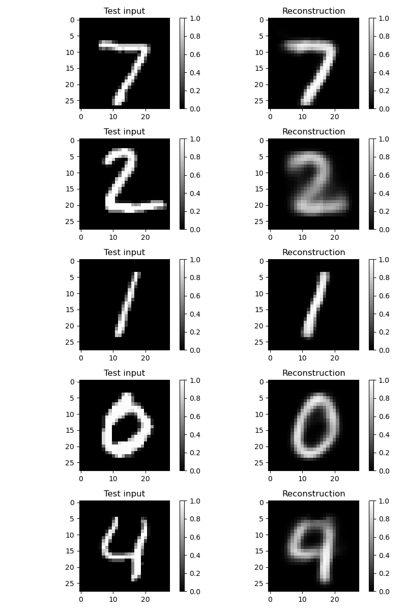
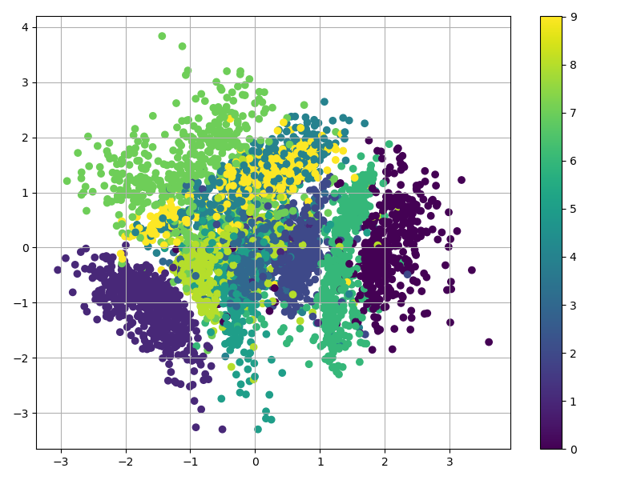
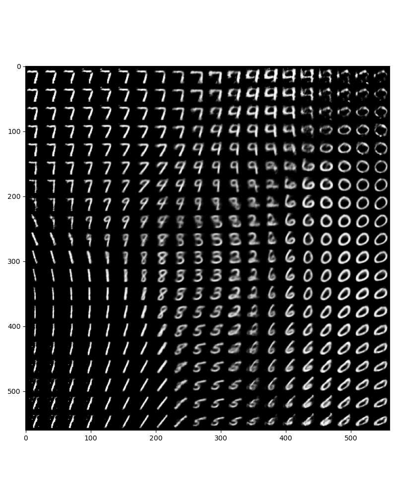

# Varitional Auto-Encoder

In this lesson, we implement a variational autoencoder to reconstruct and generate new MNIST images.


## Run the demo

```bash
python train.py
```

## Visualization
### Reconstruction
Based on the trained model, we can sample test inputs and visualize how well the VAE can reconstruct those. In general the VAE does really well.



### Recognition
Based on the trained model, we can illustrate how the encoder (the recognition network) encodes some of the labeled inputs (collapsing the Gaussian distribution in latent space to its mean). This gives some insights into the structure of the learned manifold (latent space).



### Generation
An other way of getting insights into the latent space is to use the generator network to plot reconstructions at the positions in the latent space for which they have been generated.



